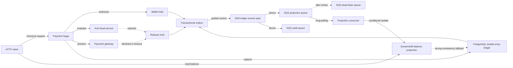

# Distributed Wallet Ledger

<p align="center">
  
</p>

<p align="center">
  Event-driven financial ledger and wallet platform built with Go, PostgreSQL, DynamoDB, SNS/SQS and Kubernetes.
</p>

## Overview

Distributed Wallet Ledger is an educational platform for studying reliable financial systems. It starts with a small, explicit double-entry ledger and evolves only when a concrete problem justifies a new architectural pattern.

The first product built on top of the platform will be a Wallet. The ledger remains the financial source of truth so that future products such as investments, brokerage, payments, or settlement can reuse the same accounting foundation.

## Goals

- Build a correct and auditable financial ledger.
- Learn financial-domain modeling through working software.
- Explore architecture, consistency, concurrency, resilience, observability, and infrastructure incrementally.
- Make tradeoffs and architectural decisions visible enough for study, interviews, and portfolio discussions.

## What This Project Explores

The roadmap includes Go, pragmatic Domain-Driven Design, hexagonal architecture, double-entry bookkeeping, PostgreSQL, SQLC, ACID transactions, idempotency, CQRS, event-driven integration, resilience, distributed workflows, observability, and platform engineering.

These are learning destinations, not a checklist. A technology or pattern is introduced only when the current design exposes a problem that it can solve.

## Domain

The initial domain is a financial ledger composed of accounts, business transactions, journal entries, and debit/credit postings. Every posted journal entry must balance: total debits equal total credits. Posted financial facts are immutable; corrections are represented by reversal entries.

Money is represented as integer minor units (for example, BRL cents), never as `float64`.

## Architectural Patterns & Highlights

- **Hexagonal Architecture (Ports and Adapters):** Strict domain isolation where business rules, accounts, and financial invariants are completely agnostic of database, transport, or cloud providers.
- **Distributed Workflows & Saga Pattern:** Orchestrated multi-step payment execution (`Authorize Hold` -> `Anti-Fraud Check` -> `External Payment Gateway` -> `Capture Hold` / `Compensate Release`) guaranteeing eventual consistency without distributed locks.
- **CQRS (Command Query Responsibility Segregation):** Write model persists durable double-entry entries in PostgreSQL with ACID guarantees, while high-throughput balance queries read from a dedicated DynamoDB projection.
- **Transactional Outbox Pattern:** Atomic, zero-dual-write event publishing within PostgreSQL transactions (`FOR UPDATE SKIP LOCKED`) combined with full jitter exponential backoff and relay dispatching.
- **Event-Driven Architecture with SNS + SQS Fanout:** Outbox events publish to an AWS SNS Topic (`ledger-events`), which broadcasts in parallel to dedicated AWS SQS queues with Dead Letter Queues (DLQ) for asynchronous, decoupled consumers.
- **Resilience, Fallbacks & Circuit Breakers:** Native zero-dependency Circuit Breaker state machine (`Closed`, `Open`, `Half-Open`) protecting external dependencies (Payment Gateways) with fail-fast rejections and Prometheus telemetry, alongside real-time balance fallback from DynamoDB to PostgreSQL.
- **Infrastructure as Code:** Complete local AWS topology (DynamoDB, SNS, SQS, DLQ, Subscriptions) managed with Terraform and Docker Compose.

## Architecture



## Technology Stack

- **Go 1.25+** (Standard library, `chi` router, AWS SDK v2, `pgx/v5`)
- **PostgreSQL 16** (ACID double-entry ledger & transactional outbox)
- **SQLC** (Type-safe SQL queries)
- **AWS DynamoDB** (CQRS read model projections with optimistic concurrency)
- **AWS SNS + SQS** (Pub/Sub Fanout messaging with DLQ)
- **Terraform** (Infrastructure as Code for local and cloud environments)
- **Ministack / Docker Compose** (Deterministic local AWS emulation)
- **golang-migrate** (Database versioning and schema migrations)

## Current Status

- **Phase 1 — Ledger Core:** ✅ Complete (Double-entry accounting, ACID postings, immutability, idempotency)
- **Phase 2 — Wallet:** ✅ Complete (Deposits, withdrawals, transfers, authorizations, and holds)
- **Phase 3 — CQRS & Read Model:** ✅ Complete (DynamoDB projections with PostgreSQL live fallback)
- **Phase 4 — Event-Driven Architecture:** ✅ Complete (Transactional Outbox, SNS/SQS Fanout, SQS consumers, DLQ)
- **Phase 5 — Resilience:** ✅ Complete (Optimistic concurrency/out-of-order protection, full jitter backoff, failure tests)
- **Phase 6 — Distributed Workflows (Sagas):** ✅ Complete (Payment Saga Orchestrator, Anti-Fraud check, Mock Gateway, Hold Captures & Compensations)
- **Phase 7 — Platform Engineering:** ✅ Complete (Kubernetes, Helm Chart, HPA Autoscaling, PDB, AWS SSM Parameter Store, Chaos Engineering Lab)
- **Phase 8 — Reliability & Observability:** ✅ Complete (OpenTelemetry Distributed Tracing, Prometheus Metrics, Jaeger UI, Correlation IDs, Structured Slog, Real-Time Terminal Load Generator)

## Roadmap

1. Ledger Core (Completed)
2. Wallet (Completed)
3. CQRS Read Model (Completed)
4. Event Driven & Outbox (Completed)
5. Resilience (Completed)
6. Distributed Workflows / Sagas (Completed)
7. Platform Engineering / Kubernetes (Completed)
8. Reliability & Observability (Completed)
9. Future: Investments / Brokerage

See the [detailed roadmap](docs/01-product/roadmap.md).

## Running Locally

Prerequisites: Go, Docker Compose, Terraform, `sqlc`, and the `golang-migrate` CLI.

```sh
copy .env.example .env
make infra-up
make migrate-up
make test
```

`make infra-up` starts PostgreSQL and Ministack, then applies the local Terraform
topology for DynamoDB, SNS, SQS, the wallet projection queue, and its DLQ. The
database runs on `localhost:5432`. To run the real PostgreSQL integration suite, use:

```sh
make test-integration
```

This starts PostgreSQL, waits for its healthcheck, applies migrations, and runs tests with the `integration` build tag. The `migrate` CLI must be available on `PATH`.

The API command initializes configuration and dependency injection, starts the HTTP server, and exposes the current Ledger Core and Wallet endpoints.

Useful commands are documented in the [local development guide](docs/README.md).

## Repository Structure

```text
cmd/                         application entrypoints and load generator
internal/ledger/domain/      pure domain model and invariants
internal/ledger/application/ use-case orchestration and ports
internal/ledger/adapters/    external adapters, including PostgreSQL
internal/platform/config/    environment-backed application configuration
internal/bootstrap/          composition root for dependency injection
migrations/                  versioned database migrations
scripts/                     local development helpers
docs/                        durable product, domain, architecture, and ADR docs
deploy/                      Kubernetes, Helm, and Prometheus manifests
web/                         architecture and Saga visualization dashboard
reports/                     load-test reports and reliability evidence
assets/                      repository presentation assets
infra/                       reserved for infrastructure experiments when needed
observability/               reserved for observability configuration when needed
```

## Documentation

Start at [docs/README.md](docs/README.md). The current scope is in [Phase 2](docs/phases/phase-02-wallet.md), and the initial architecture decision is [ADR 0001](docs/adr/0001-postgresql-as-ledger-source-of-truth.md).

## Architecture Decisions

Architecture decisions are recorded in [docs/adr](docs/adr/README.md). Future technologies are described as planned possibilities, not current commitments.

## Testing

Domain and configuration unit tests run without infrastructure. Integration tests use the real PostgreSQL instance managed by Docker Compose and are isolated behind the `integration` build tag. PostgreSQL is not mocked in integration tests.

## Disclaimer

This is an educational project and is not production financial infrastructure, accounting advice, investment advice, or a payment service.
