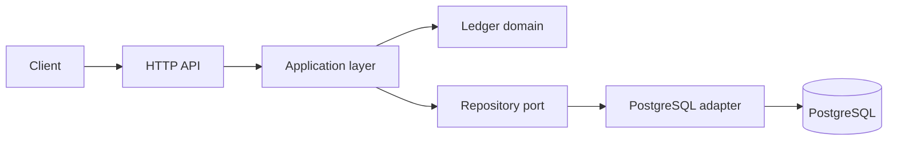

# Financial Ledger

## Overview

Financial Ledger is an educational platform for studying reliable financial systems. It starts with a small, explicit double-entry ledger and evolves only when a concrete problem justifies a new architectural pattern.

The first product built on top of the platform will be a Wallet. The ledger remains the financial source of truth so that future products such as investments, brokerage, payments, or settlement can reuse the same accounting foundation.

## Goals

- Build a correct and auditable financial ledger.
- Learn financial-domain modeling through working software.
- Explore architecture, consistency, concurrency, resilience, observability, and infrastructure incrementally.
- Make tradeoffs and architectural decisions visible enough for study, interviews, and portfolio discussions.

## What This Project Explores

The roadmap includes Go, pragmatic Domain-Driven Design, hexagonal architecture, double-entry bookkeeping, PostgreSQL, SQLC, ACID transactions, idempotency, CQRS, event-driven integration, resilience, distributed workflows, observability, and platform engineering.

These are learning destinations, not a checklist. A technology or pattern is introduced only when the current design exposes a problem that it can solve.

## Domain

The initial domain is a financial ledger composed of accounts, business transactions, journal entries, and debit/credit postings. Every posted journal entry must balance: total debits equal total credits. Posted financial facts are immutable; corrections are represented by reversal entries.

Money is represented as integer minor units (for example, BRL cents), never as `float64`.

## Current Architecture

The current architecture is intentionally small:



PostgreSQL is the source of truth in Phase 1. There is no distributed messaging, read-model database, or microservice split yet.

## Technology Stack

- Go 1.25+
- PostgreSQL 16 via Docker Compose
- SQLC for typed SQL access
- `golang-migrate` CLI for migrations
- `net/http` for the initial HTTP boundary
- Makefile for repeatable local commands

## Current Phase

**Phase 1 — Ledger Core**

This setup prepares the repository and database boundary. The ledger use cases and domain rules will be implemented in the next step; they are not implemented by this scaffold.

## Roadmap

1. Ledger Core
2. Wallet
3. CQRS
4. Event Driven
5. Resilience
6. Distributed Workflows
7. Platform
8. Reliability
9. Future: Investments / Brokerage

See the [detailed roadmap](docs/01-product/roadmap.md).

## Running Locally

Prerequisites: Go, Docker Compose, `sqlc`, and the `golang-migrate` CLI.

```sh
copy .env.example .env
make compose-up
make migrate-up
make test
```

The database runs on `localhost:5432`. The API command is currently a compileable scaffold only.

Useful commands are documented in the [local development guide](docs/README.md).

## Repository Structure

```text
cmd/                         application entrypoints
internal/ledger/domain/      pure domain model and invariants
internal/ledger/application/ use-case orchestration and ports
internal/ledger/adapters/    external adapters, including PostgreSQL
migrations/                  versioned database migrations
scripts/                     local development helpers
docs/                        durable product, domain, architecture, and ADR docs
deploy/                      reserved for deployment manifests when needed
infra/                       reserved for infrastructure experiments when needed
observability/               reserved for observability configuration when needed
```

## Documentation

Start at [docs/README.md](docs/README.md). The current scope is in [Phase 1](docs/phases/phase-01-ledger-core.md), and the initial architecture decision is [ADR 0001](docs/adr/0001-postgresql-as-ledger-source-of-truth.md).

## Architecture Decisions

Architecture decisions are recorded in [docs/adr](docs/adr/README.md). Future technologies are described as planned possibilities, not current commitments.

## Testing

Domain unit tests will run without infrastructure. Integration tests will use a real PostgreSQL instance, eventually through Testcontainers or an equivalent isolated strategy. PostgreSQL will not be mocked in integration tests.

## Disclaimer

This is an educational project and is not production financial infrastructure, accounting advice, investment advice, or a payment service.
