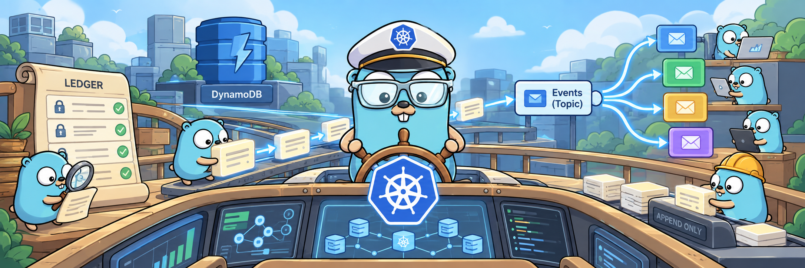
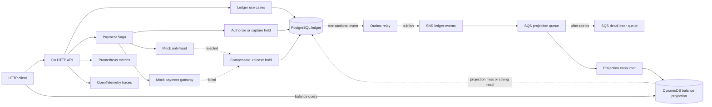

# Distributed Wallet Ledger

<p align="center">
  
</p>

<p align="center">
  A Go backend for wallets, double-entry accounting and event-driven payment workflows.
</p>

Distributed Wallet Ledger is a modular monolith that exposes a financial HTTP API and keeps PostgreSQL as the authoritative ledger. It supports wallet operations, reservations, idempotent retries, simulated payment orchestration, asynchronous balance projections and production-oriented observability.

The project is designed as a practical backend and architecture case study: the accounting rules are explicit, financial facts are immutable, and every additional distributed component has a concrete responsibility.

## What it does

- Records balanced double-entry transactions with immutable postings and compensating reversals.
- Creates wallets and supports deposits, withdrawals, wallet-to-wallet transfers and balance queries.
- Separates ledger balance from available balance through authorization holds.
- Authorizes, releases, expires and captures holds with PostgreSQL locking and idempotency.
- Runs a payment checkout Saga with hold authorization, mock anti-fraud, a mock gateway, capture and compensation.
- Publishes wallet events through a transactional outbox and SNS/SQS fanout.
- Maintains a DynamoDB wallet-balance projection while retaining PostgreSQL as the source of truth.
- Falls back to PostgreSQL for balance reads when the projection is unavailable or a strong read is requested.
- Exposes Prometheus metrics, OpenTelemetry traces, structured logs, request/trace IDs and circuit-breaker telemetry.
- Includes Docker Compose, Terraform, Kubernetes/Helm manifests, a load generator and a small architecture/Saga dashboard.

The payment flow is intentionally simulated with local anti-fraud and gateway adapters. The repository does not connect to a real payment rail, bank or external settlement provider.

## Stack

| Area | Technologies |
| --- | --- |
| Language and HTTP | Go, `net/http`, `chi` |
| Accounting store | PostgreSQL 16, `pgx/v5`, SQLC, `golang-migrate` |
| Domain model | Double-entry ledger, integer minor units, idempotency, holds and reversals |
| Read model | DynamoDB projection with PostgreSQL fallback |
| Messaging | SNS topic, SQS projection queue, DLQ and transactional outbox |
| Resilience | Exponential backoff with jitter, circuit breaker and concurrency-safe PostgreSQL operations |
| Observability | Prometheus, OpenTelemetry, Jaeger and structured `slog` logs |
| Local infrastructure | Docker Compose, MiniStack and Terraform |
| Deployment assets | Kubernetes, Helm, HPA, PDB and optional SSM-backed configuration |

## Architecture

The application is a modular monolith with feature-oriented packages. The domain does not depend on HTTP, PostgreSQL, AWS or frameworks. Adapters translate external protocols and persistence representations at the boundary.



### Accounting boundary

PostgreSQL stores the financial facts: accounts, transactions, journal entries, postings, wallets, holds and idempotency records. A journal entry is accepted only when its debit and credit postings balance. Posted facts are not edited or deleted; corrections are new balanced transactions.

Money is represented as integer minor units, such as cents, never as floating-point values.

### Read and event boundary

The write path commits ledger changes and outbox events in PostgreSQL. The relay publishes those events to SNS, and the SQS consumer updates the DynamoDB wallet projection with ordering and conditional-write protection. The projection is a read optimization, not a second financial source of truth.

### Payment boundary

Checkout is an orchestrated Saga over local components. It coordinates a hold, anti-fraud decision, gateway result and capture. Failures compensate the hold when possible. The gateway and anti-fraud implementations are mocks so the workflow can be tested without external credentials or payment networks.

## API surface

### Health and observability

```text
GET  /health
GET  /health/live
GET  /health/ready
GET  /metrics
```

### Ledger

```text
POST /accounts
POST /transactions
GET  /transactions/{transactionID}
GET  /accounts/{accountID}/entries
POST /transactions/{transactionID}/reversal
```

### Wallets and funds

```text
POST /wallets
GET  /wallets/{walletID}
GET  /owners/{ownerID}/wallets
GET  /wallets/{walletID}/balance
POST /wallets/{walletID}/deposits
POST /wallets/{walletID}/withdrawals
POST /wallets/{walletID}/transfers
```

### Holds and checkout

```text
POST /wallets/{walletID}/holds
POST /holds/{holdID}/release
POST /holds/{holdID}/expire
POST /holds/{holdID}/capture
POST /payments/checkout
```

Financial write operations accept `Idempotency-Key` where applicable. Balance reads use the projection by default; `GET /wallets/{walletID}/balance?consistency=strong` reads directly from the ledger.

## Run locally

### Prerequisites

Go, Docker Compose, Terraform, `sqlc` and the `golang-migrate` CLI.

### Start the dependencies

```sh
copy .env.example .env
make infra-up
make migrate-up
```

`make infra-up` starts:

- PostgreSQL on `localhost:5432`;
- MiniStack on `localhost:4566` with DynamoDB, SNS, SQS and SSM;
- the local Terraform resources for the projection table, topic, queue, DLQ and subscriptions.

Optional local observability services are available through Docker Compose:

- Jaeger UI: `http://localhost:16686`;
- Prometheus: `http://localhost:9090`.

### Run the API

```sh
go run ./cmd/api
```

The API listens on `http://localhost:8080` by default.

### Validate the project

```sh
make test
make vet
make build
make test-integration
```

The integration suite uses the real PostgreSQL service and is isolated behind the `integration` build tag. More validation helpers are documented in [scripts/README.md](scripts/README.md).

## Repository structure

```text
cmd/                         application entrypoints and load generator
internal/ledger/domain/      pure domain model and invariants
internal/ledger/application/ use-case orchestration and ports
internal/ledger/adapters/    external adapters, including PostgreSQL
internal/platform/config/    environment-backed application configuration
internal/bootstrap/          composition root for dependency injection
migrations/                  versioned database migrations
scripts/                     local development helpers
docs/                        durable product, domain, architecture, and ADR docs
deploy/                      Kubernetes, Helm, and Prometheus manifests
web/                         architecture and Saga visualization dashboard
reports/                     load-test reports and reliability evidence
assets/                      repository presentation assets
terraform/local/             local AWS-compatible resources
```

## Documentation

Start at the [documentation index](docs/README.md), then read the [current scope](docs/01-product/scope.md), [current architecture](docs/03-architecture/overview.md), [domain overview](docs/02-domain/overview.md) and [ADR index](docs/adr/README.md).

## Disclaimer

This is an educational project and is not production financial infrastructure, accounting advice, investment advice, or a payment service.
