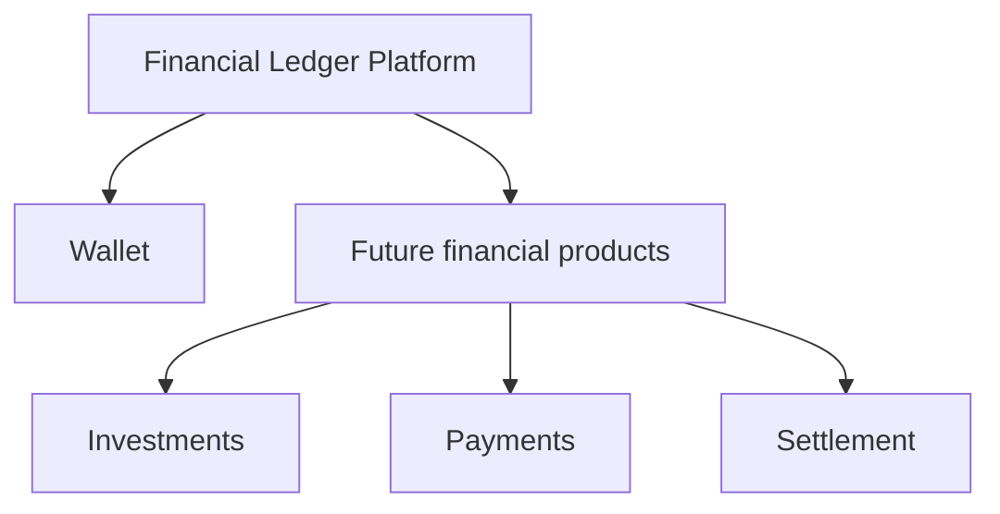

# Product Vision

## Problem

Financial products need a reliable accounting core. A wallet may look like a balance and a few endpoints, but correctness depends on preserving financial facts, enforcing balanced entries, handling retries safely, and making changes auditable.

## Objective

Financial Ledger is a practical laboratory for building that accounting core and evolving its architecture in response to real problems. The project values explicit invariants, understandable code, and documented tradeoffs over premature complexity.

## Product Vision

The Ledger will be a reusable financial platform whose first product is a Wallet. Over time, the same source of truth may support investments, brokerage, payments, settlement, or other products with accounting needs.

## Learning Objectives

The project is intended to study Go, pragmatic DDD, hexagonal architecture, double-entry bookkeeping, PostgreSQL, SQLC, consistency, concurrency, idempotency, resilience, observability, and infrastructure in incremental phases.

## Non-goals

- It is not production financial infrastructure.
- It is not a payment processor, bank, broker, or accounting certification.
- It does not implement every technology in the roadmap from the beginning.
- It does not optimize for distributed deployment before the single-database design has a concrete limitation.
