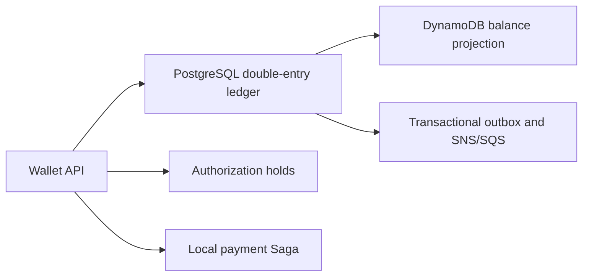

# Product Vision

## Problem

Financial products need a reliable accounting core. A wallet may look like a balance and a few endpoints, but correctness depends on preserving financial facts, enforcing balanced entries, handling retries safely, and making changes auditable.

## Objective

Distributed Wallet Ledger is a practical backend for exploring those problems with working code. It combines a double-entry ledger, wallet operations, authorization holds, a simulated payment workflow and asynchronous balance projections without hiding the accounting boundary behind a generic CRUD model.

## Product boundary

The implemented product is a Wallet backed by a PostgreSQL ledger. It supports deposits, withdrawals, wallet transfers, ledger and available balances, holds and a local checkout Saga. The ledger remains the financial source of truth; DynamoDB is only a derived read projection.

The checkout flow uses mock anti-fraud and payment-gateway adapters. It demonstrates orchestration, compensation and idempotency, but it is not a connection to a real payment network.

## Learning Objectives

The project studies Go, pragmatic DDD, hexagonal architecture, double-entry bookkeeping, PostgreSQL, SQLC, consistency, concurrency, idempotency, resilience, observability, messaging and platform engineering through an implemented system.

## Non-goals

- It is not production financial infrastructure.
- It is not a payment processor, bank, broker, or accounting certification.
- It does not connect to real payment rails or external settlement providers.
- It does not implement user authentication, authorization, reconciliation or multi-currency conversion.
- It does not use event sourcing as its persistence model.
