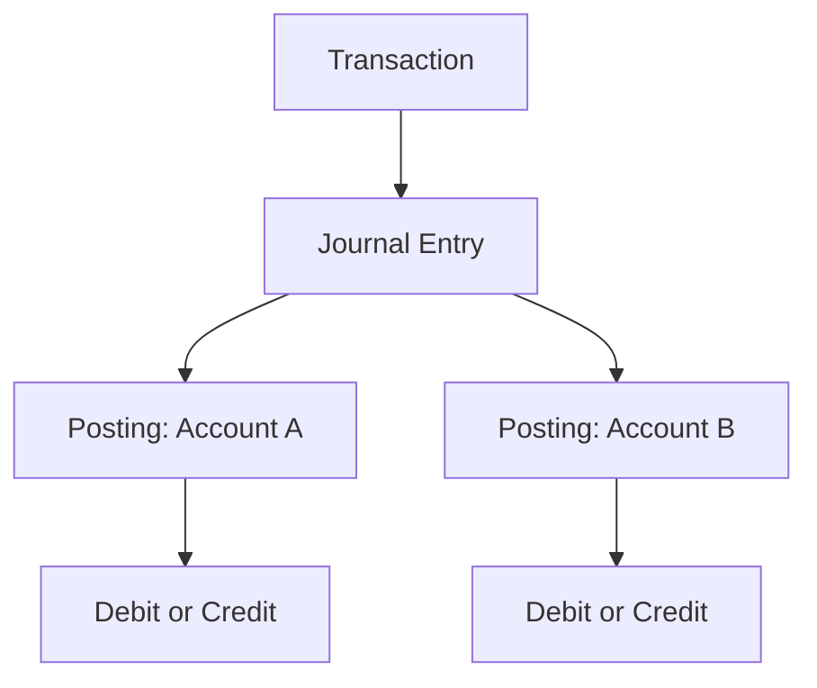

# Domain Overview

The initial domain separates the business operation from its accounting representation:

A transaction may describe a transfer of R$100, while the journal entry contains the balanced postings that make that transfer financially explicit. The entry is the unit of atomic persistence. Postings refer to accounts and use positive integer minor units.

In Phase 1, one transaction has one posted journal entry. Keeping both concepts explicit preserves the distinction between business intent and accounting fact without introducing a general event-sourcing model.
