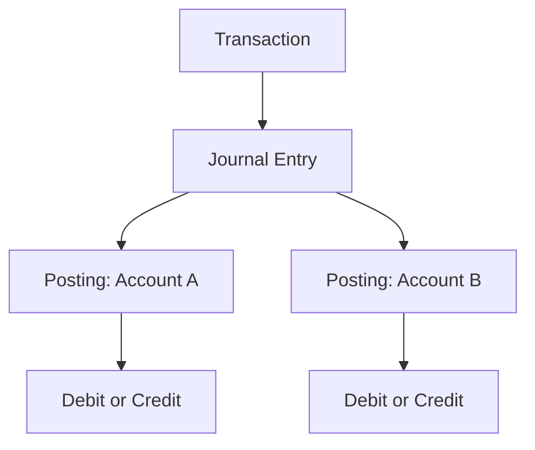
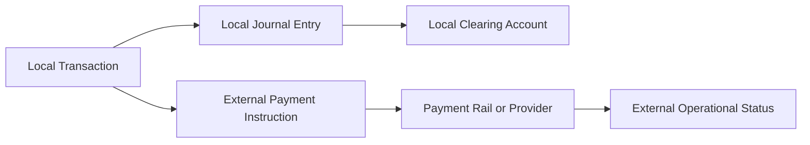

# Domain Overview

The initial domain separates the business operation from its accounting representation:

A transaction may describe a transfer of R$100, while the journal entry contains the balanced postings that make that transfer financially explicit. The entry is the unit of atomic persistence. Postings refer to accounts and use positive integer minor units.

One business transaction has one posted journal entry. Keeping both concepts explicit preserves the distinction between business intent and accounting fact without introducing a general event-sourcing model.

The implemented checkout Saga uses local operational components around the ledger: a wallet hold, mock anti-fraud service and mock payment gateway. A successful checkout captures the hold and posts the final ledger transaction; a rejected or failed checkout releases the hold.

## External payment boundary

For a payment to another institution, the external destination is not a local Ledger account. The future model keeps the local accounting fact and the external payment operation separate:

The provider or payment rail may return an asynchronous result through a queue or callback. That result updates the payment instruction status and may trigger a compensating Ledger entry when necessary. It does not edit the original postings. The current repository stops before this boundary and uses mocks for the checkout workflow.
