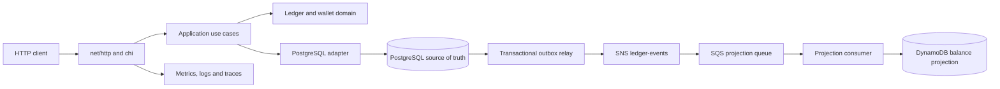

# Current Architecture

Distributed Wallet Ledger is a modular monolith. PostgreSQL is the financial source of truth; DynamoDB, SNS and SQS are derived integration and read-model infrastructure. The system keeps the accounting boundary in one process while making asynchronous behavior, failure handling and operational concerns explicit.

## Runtime shape



## Dependency direction

Dependencies point inward:

```text
Adapters -> Application -> Domain
```

- `internal/ledger/domain` contains accounting rules, value objects and invariants. It does not import PostgreSQL, SQLC, HTTP, AWS or frameworks.
- `internal/ledger/application` coordinates use cases and owns ports needed by those use cases, including wallet, outbox and Saga boundaries.
- `internal/ledger/adapters` translates HTTP, PostgreSQL, DynamoDB, SNS, SQS and gateway interactions.
- `internal/platform` contains configuration, AWS clients, observability and resilience primitives shared by adapters and composition code.
- `internal/bootstrap` creates concrete adapters, starts the outbox relay, projection consumer and hold-expiration worker, and wires the use cases.
- `cmd/api` owns process startup and the HTTP server.

## Runtime composition

The composition root loads environment or optional SSM configuration, opens PostgreSQL, creates the repositories and starts the outbox relay, projection consumer, hold-expiration worker and HTTP handlers. It also wires the local SNS/SQS event path and the circuit-breaker-protected mock payment gateway.

## Write path and source of truth

Financial writes go through PostgreSQL transactions. Ledger postings, wallet state changes, holds and idempotency records are persisted at the same consistency boundary. Events are inserted into `outbox_events` in that transaction so the application does not need to perform an unsafe database-write-plus-publish dual write.

The outbox relay claims pending events, publishes them to SNS and records the result with retry metadata. Claim recovery prevents a stale worker from permanently hiding an event, while the relay's backoff limits repeated failures.

## Read path and messaging

The SQS projection consumer applies wallet events to DynamoDB using conditional ordering protection. A projection miss or infrastructure failure does not change the financial truth: the balance use case can calculate from PostgreSQL, and clients can request `consistency=strong` explicitly.

The current local topology has one SNS topic, one wallet-balance SQS queue and one DLQ. Additional consumers can be added without changing the ledger write path.

## Payment Saga

`PaymentSagaOrchestrator` coordinates four local steps:

1. authorize a wallet hold;
2. evaluate the request with the mock anti-fraud service;
3. process the payment through the mock gateway and its circuit breaker;
4. capture the hold and create the final ledger postings.

Anti-fraud rejection and gateway failure release the hold as compensation. The flow demonstrates a distributed-workflow shape without claiming to integrate with an external provider.

## Observability and operations

The HTTP server emits structured request logs, correlation headers and trace spans. Prometheus metrics cover HTTP requests, Saga outcomes, outbox publication, SQS processing and circuit-breaker state. Docker Compose provides Jaeger and Prometheus for local inspection. Kubernetes and Helm manifests provide deployment, service, HPA, PDB and observability resources.

## Persistence layout

- `migrations/` contains versioned `golang-migrate` SQL.
- `internal/ledger/adapters/postgres/queries/` contains handwritten SQLC queries.
- `internal/ledger/adapters/postgres/generated/` contains generated database access code.
- Adapters map generated rows to domain types; domain types are not aliases of database records.
- Migrations are executed explicitly by local commands, not by API startup.

## Deliberately outside the architecture

The repository does not currently contain real external payment providers, settlement callbacks, reconciliation, authentication or independently deployable services. Those concerns would require new domain boundaries and decisions instead of being inferred from the existing mock checkout flow.
