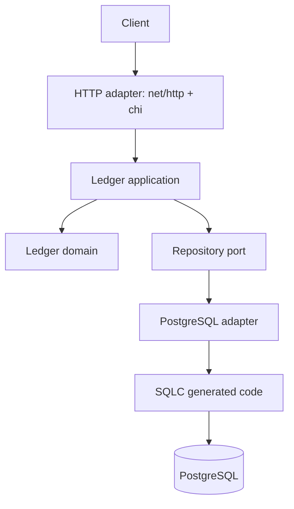
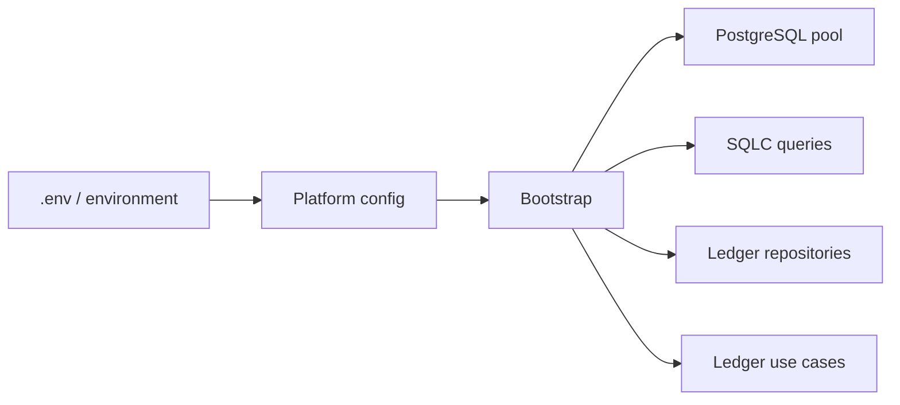

# Current Architecture

Phase 1 uses a modular monolith with a single PostgreSQL source of truth. The design is inspired by hexagonal architecture and pragmatic DDD, but it does not add layers or interfaces without a current use.



The application is assembled by a composition root:



## Dependency direction

Dependencies point inward:

```text
Adapters -> Application -> Domain
```

- `internal/ledger/domain` contains rules and value concepts. It MUST NOT import PostgreSQL, SQLC, HTTP, AWS, or frameworks.
- `internal/ledger/application` coordinates use cases. It owns an outbound port only when a use case needs one, such as a repository boundary.
- `internal/ledger/adapters` translates external protocols and persistence representations. PostgreSQL-specific code and SQLC-generated code stay here.
- `internal/platform/config` loads environment-backed configuration. It has no SSM integration yet.
- `internal/bootstrap` composes concrete adapters and application use cases.
- `cmd/api` owns process startup and the HTTP server composition.

## Package-by-feature layout

The ledger owns its domain, application, and adapters under one feature boundary. This avoids global `controllers`, `services`, and `repositories` directories that mix unrelated future products.

## Persistence layout

- `migrations/` contains versioned `golang-migrate` SQL.
- `internal/ledger/adapters/postgres/queries/` contains handwritten SQLC queries.
- `internal/ledger/adapters/postgres/generated/` contains generated database access code.
- Domain types must not be aliases of generated database records; adapters map between them.
- Migrations are executed explicitly by local infrastructure commands, not by API startup.

## Deliberately deferred

There is no DynamoDB read model, outbox, message broker, event-sourcing store, Kubernetes deployment, or service split in the current architecture. Those belong to later phases only if a concrete problem makes them useful.
