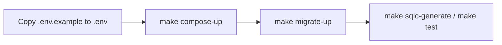

# Documentation

This directory contains durable project documentation. The root [README](../README.md) is the entry point for running the repository; these documents preserve the reasoning behind the domain and architecture.

## Product

- [Vision](01-product/vision.md)
- [Scope](01-product/scope.md)
- [Glossary](01-product/glossary.md)
- [Roadmap](01-product/roadmap.md)

## Domain

- [Domain overview](02-domain/overview.md)
- [Ledger](02-domain/ledger.md)
- [Accounting rules](02-domain/accounting-rules.md)
- [Invariants](02-domain/invariants.md)

## Architecture and phases

- [Current architecture](03-architecture/overview.md)
- [Phase 1 — Ledger Core](phases/phase-01-ledger-core.md)

## Decisions

- [ADR index](adr/README.md)
- [ADR 0001 — PostgreSQL as ledger source of truth](adr/0001-postgresql-as-ledger-source-of-truth.md)

## Local development

The initial workflow is:

The detailed Phase 1 specification is the authority for what is planned and what is implemented.
