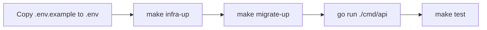

# Documentation

This directory contains the durable product, domain and architecture documentation for Distributed Wallet Ledger. The root [README](../README.md) is the practical entry point; these documents explain the boundaries and decisions behind the implementation.

## Product

- [Vision](01-product/vision.md)
- [Current scope](01-product/scope.md)
- [Glossary](01-product/glossary.md)
- [Learning roadmap](01-product/roadmap.md)

## Domain

- [Domain overview](02-domain/overview.md)
- [Ledger](02-domain/ledger.md)
- [Accounting rules](02-domain/accounting-rules.md)
- [Invariants](02-domain/invariants.md)

## Architecture

- [Current architecture](03-architecture/overview.md)
- [Phase 1 — Ledger Core](phases/phase-01-ledger-core.md)
- [Phase 2 — Wallet](phases/phase-02-wallet.md)

## Decisions

- [ADR index](adr/README.md)
- [ADR 0001 — PostgreSQL as ledger source of truth](adr/0001-postgresql-as-ledger-source-of-truth.md)
- [ADR 0002 — External accounts are not local ledger accounts](adr/0002-external-accounts-are-not-local-ledger-accounts.md)

## Local development

The supported local workflow is:

The local infrastructure uses PostgreSQL on port `5432` and MiniStack on port `4566`. Terraform provisions the local DynamoDB, SNS, SQS, DLQ and SSM resources used by the application.
