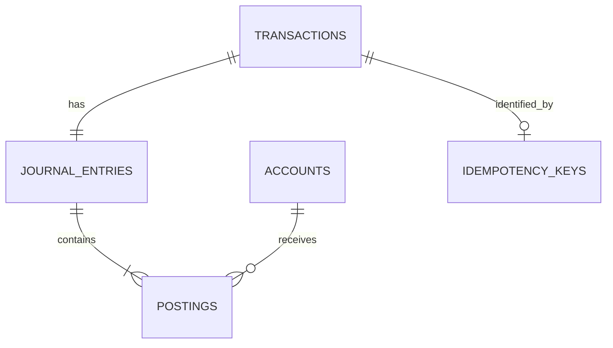

# Phase 1 — Ledger Core

## Goal

Build a small, reliable double-entry ledger whose posted financial facts are balanced, atomic, immutable, queryable, and safe to retry.

## Why This Phase Exists

All later products and architectural experiments need a trustworthy accounting foundation. Starting with a single Go process and PostgreSQL makes transaction boundaries, invariants, and failure behavior observable before distribution adds more failure modes.

## Concepts

- Account
- Transaction
- Journal entry
- Posting
- Debit and credit
- Money in integer minor units
- Immutability and reversal
- Idempotency
- PostgreSQL ACID transactions
- Repository boundaries, SQLC, and integration testing

## Functional Requirements

1. Create a ledger account with a code, name, and currency.
2. Create and post a transaction with a balanced journal entry.
3. Query a transaction and its postings.
4. Query postings for an account in deterministic order.
5. Reverse a posted transaction by creating a new compensating transaction.
6. Return the same result for a safe idempotent retry and reject conflicting reuse of a key.

The repository currently contains schema and SQLC query scaffolding for these capabilities; the use cases are the next implementation step.

## Non-Functional Requirements

- Atomicity: one journal entry commits all postings or none.
- Consistency: domain invariants are validated before commit.
- Immutability: posted facts are not updated or deleted as corrections.
- Idempotency: retries do not duplicate financial effects.
- Testability: domain tests run without PostgreSQL; integration tests use real PostgreSQL.
- Explicitness: SQL and errors remain visible; no heavy framework is required.

## Domain Model



`Transaction` expresses the business operation. `JournalEntry` is its posted accounting representation. `Posting` applies one positive amount and one direction to an `Account`. `IdempotencyKey` is technical coordination data linked to the resulting transaction.

## Invariants

The complete normative list is in [invariants.md](../02-domain/invariants.md). In short:

- Debits MUST equal credits.
- Amounts MUST be positive integer minor units.
- All postings in an entry MUST share its currency.
- All postings MUST be written atomically.
- Posted records MUST NOT be mutated or deleted.
- Reversals MUST be new compensating entries.
- Idempotent retries MUST NOT create duplicate effects.

## Architecture

Phase 1 is a modular monolith:

```text
HTTP boundary -> application use case -> domain rules -> repository port
                                                     -> PostgreSQL adapter -> PostgreSQL
```

Interfaces are introduced at application boundaries when they enable a real substitution or test seam. The domain remains independent of persistence and transport.

## Persistence

PostgreSQL is the source of truth. The initial schema contains:

- `accounts` for ledger accounts.
- `transactions` for business operations.
- `journal_entries` for posted, balanced accounting groups.
- `postings` for debit/credit lines.
- `idempotency_keys` for initial retry protection.

Amounts use `BIGINT` minor units. Database checks protect local properties such as positive amounts and valid directions. Cross-row invariants such as debit/credit equality and account currency compatibility are validated by the domain/application transaction before commit.

Migrations use the `golang-migrate` CLI with conventional up/down SQL files. It is a small, explicit fit for a single PostgreSQL database; `goose` and `atlas` remain alternatives to reassess only if migration workflows become a real problem.

IDs are UUID values generated by the application. UUIDv7 is the intended strategy when ID generation is implemented because it preserves UUID interoperability while improving time locality; the exact Go dependency remains an open decision until the domain is built.

## API

An HTTP API is not implemented yet. The planned initial boundary is `net/http`, with endpoints for account creation, transaction posting, transaction lookup, account postings, and reversal. The wire contract should be designed together with the application use cases rather than guessed in this scaffold.

## Testing Strategy

- Unit tests: pure domain behavior, including balanced/unbalanced entries, positive amounts, currency consistency, reversal rules, and idempotency decisions where applicable.
- Integration tests: application plus real PostgreSQL, covering transaction atomicity, constraints, unique idempotency keys, and query behavior.
- Concurrency tests: added when posting and balance behavior are implemented, with explicit contention scenarios.

PostgreSQL will not be mocked in integration tests. Testcontainers is a likely option when the first integration tests are added; Docker Compose remains the local development path.

## Failure Scenarios

- Unbalanced journal entry: reject before posting.
- PostgreSQL unavailable: return an explicit infrastructure error; do not report success.
- Duplicate idempotency key with the same request: return the existing result safely.
- Duplicate idempotency key with a different request: return a conflict.
- Partial insert attempt: database transaction must roll back all writes.
- Invalid amount: reject zero, negative, overflowed, or otherwise invalid values.
- Invalid or closed account: reject before commit.
- Duplicate reversal: reject without creating another compensating entry.

## Definition of Done

Phase 1 is done when:

- Account creation and lookup work against PostgreSQL.
- A valid multi-posting transaction commits atomically.
- An unbalanced entry cannot be posted.
- A posted transaction and its account postings can be queried deterministically.
- A reversal creates a new balanced entry and preserves the original.
- Same-key retries do not duplicate postings; conflicting reuse is rejected.
- Domain unit tests and PostgreSQL integration tests cover the listed invariants and failure scenarios.
- `go test ./...`, `go vet ./...`, `sqlc generate`, and the documented local migration workflow pass.
- The README and architecture documents describe the implementation state accurately.
